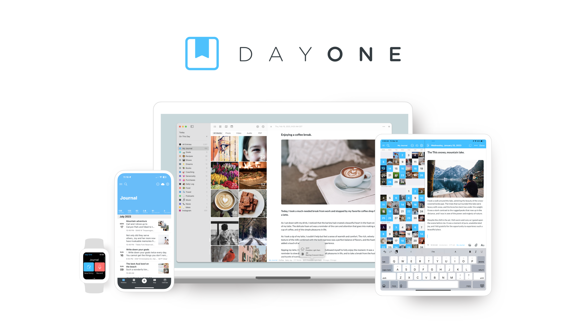
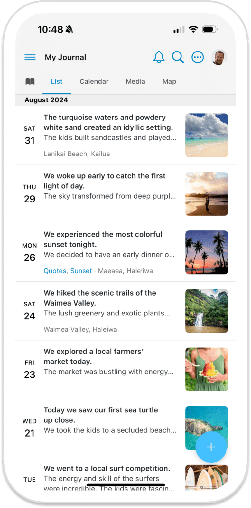
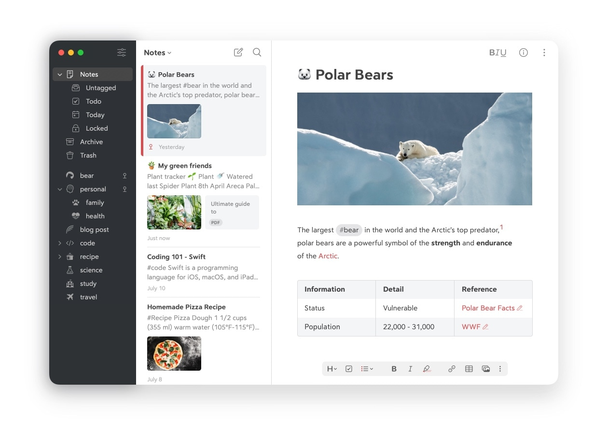
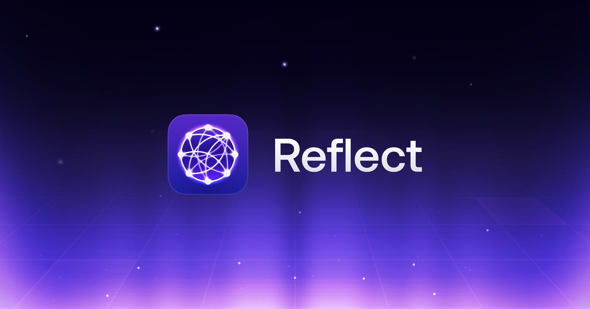
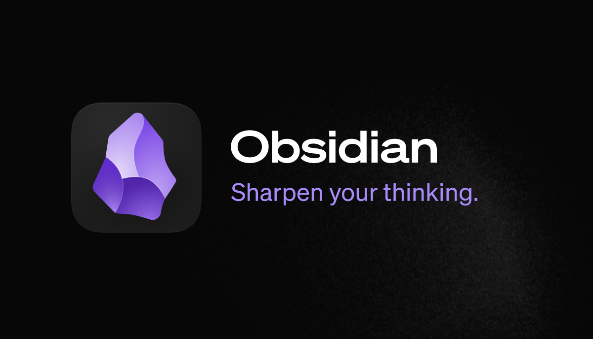
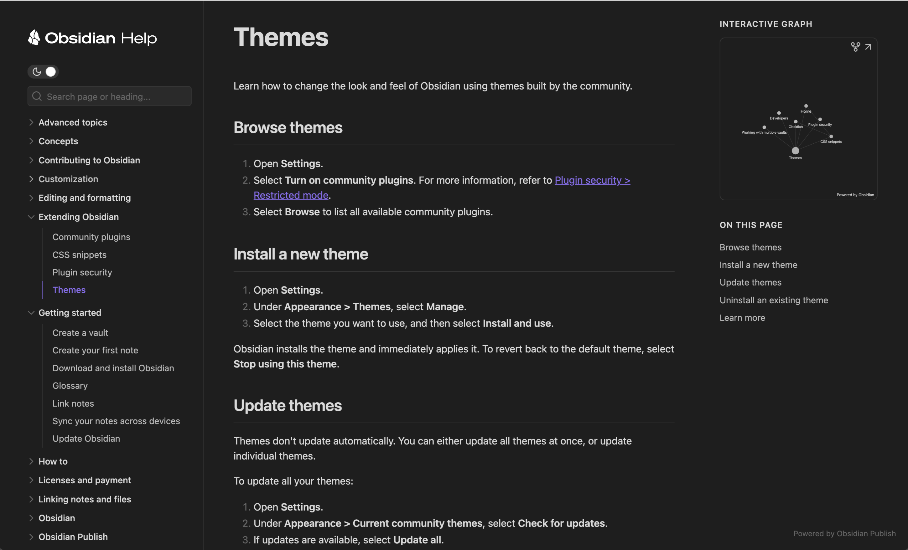
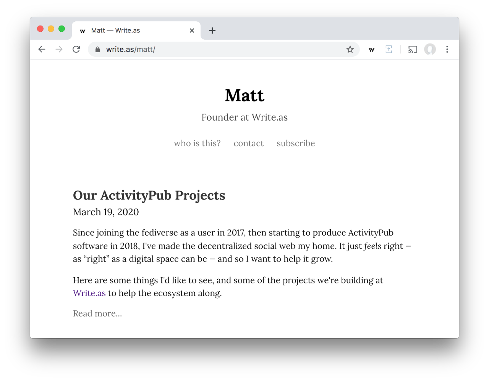
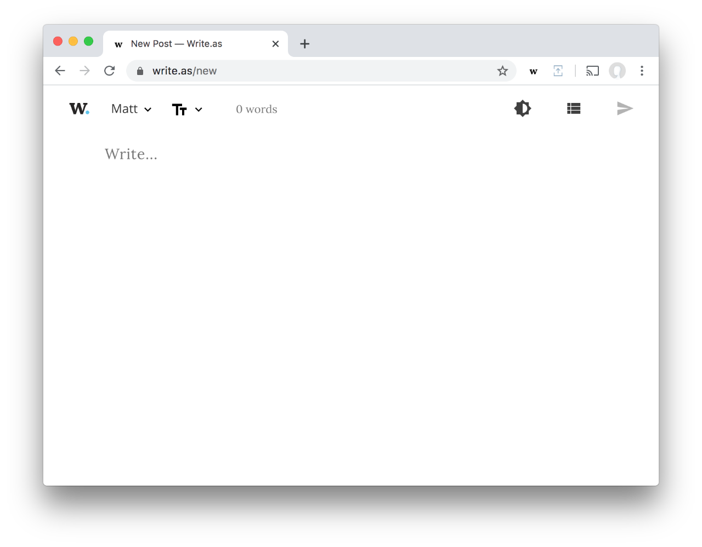

# Inner Notes 设计灵感材料

这份材料不是竞品功能清单，而是给 Inner Notes 找视觉和交互方向：什么样的日记/写作产品会让人愿意长期打开、写下去、回头看。

## 1. Day One：把一天做成可以回看的生活切片





来源：[Day One](https://dayoneapp.com/)

值得看：
- 它不是只强调“写字”，而是把照片、地点、时间、天气、设备入口都组织成一天的记忆。
- 时间线和日历让“回看”成为核心体验，而不是写完就归档。
- 视觉上很干净，但日记条目里有足够多的生活证据。

可以借给 Inner Notes：
- 每篇日记顶部做成“今日切片”：日期、情绪、睡眠、手机时间、体重、todo 状态、AI 一句话摘要。
- 日记列表不要只是标题列表，可以显示当天最强烈的一个情绪词和一句正文摘录。
- 回顾入口可以放在时间线上：本周、本月、去年今日。

## 2. Bear：写作界面安静，组织能力藏在侧边




来源：[Bear](https://bear.app/)

值得看：
- 三栏结构很经典：标签/分类、条目列表、正文编辑。
- Markdown 和富文本之间的边界处理得轻，不会让用户觉得自己在操作复杂编辑器。
- 标签、outline、图片、todo 都有，但主编辑区依然像一张干净的纸。

可以借给 Inner Notes：
- 主写作区保持最大、最安静；AI 评论、历史、todo 放到右侧批注栏或折叠区。
- 不要把所有能力平铺成按钮。写作时只露出必要控件，选中文本或需要时再出现批注/改写/提问。
- 标签不一定要用户手动管理，可以由 AI 生成“工作 / 身体 / 关系 / 机会 / 拖延”等线索标签。

## 3. Reflect：AI 是思考按钮，不是泛泛聊天框




来源：[Reflect](https://reflect.app/)

值得看：
- 它把 daily notes、任务、搜索、AI、backlinks 放在同一个思考系统里。
- AI 的定位是整理、提取、改善和连接，而不是单独开一个聊天产品。
- 左侧导航清楚，右侧内容留白多，适合长期写和查。

可以借给 Inner Notes：
- 把 AI 操作做成明确的小按钮：`看见模式`、`提一个问题`、`提取行动`、`温和反驳`、`整理成回顾素材`。
- 日记正文旁边可以出现“批注层”，像读书批注，而不是把 AI 回复塞到正文下面。
- 对一篇日记的 AI 输出分层：即时回应、局部评论、周/月回顾素材。

## 4. Obsidian：长期私有笔记的连接感





来源：[Obsidian](https://obsidian.md/)

值得看：
- 它的核心气质是“你的文字属于你”：本地、Markdown、可迁移、可连接。
- 连接不是社交连接，而是想法之间的连接。
- 图谱和 backlink 给用户一种“我不是在写散落的碎片，而是在形成自己的系统”的感觉。

可以借给 Inner Notes：
- 明确强化本地、私密、可导出的安全感。
- 做轻量“线索页”：反复出现的人、项目、情绪、身体习惯、职业主题自动聚合。
- 不必一开始做复杂图谱，可以先做“这个主题最近出现了 5 次”的线索卡片。

## 5. Ghost：写作最终可以变成一份有品牌感的公开页面


来源：[Ghost](https://ghost.org/)

值得看：
- 它把“编辑器”和“发布后的样子”连接得很强。
- 主题系统让内容有品牌感，但编辑器本身仍然克制。
- Rich media 是内容卡片，不是杂乱附件。

可以借给 Inner Notes：
- 未来可以做“整理为文章”模式：从私人日记里抽取可公开部分，隐藏隐私字段。
- 对外分享页不要做复杂博客后台，先做单篇漂亮导出。
- AI 评论可以变成文章旁注，帮助用户把原始日记变成更清楚的表达。

## 6. Write.as：打开就是写，管理感降到最低





来源：[Write.as](https://write.as/)

值得看：
- 它把“开始写”放在最前面，弱化后台、配置、管理。
- 文案和界面都很克制，给人的感觉是：这里没有复杂系统，只有文字。
- 隐私、匿名、导出、独立发布是它的信任基础。

可以借给 Inner Notes：
- 首页不做营销页，不做大仪表盘，打开就应该能写今天。
- 空白页要像邀请，而不是像任务表。
- 写完之后再让系统帮你整理，而不是写之前就让用户选择一堆设置。

## 对 Inner Notes 的综合方向

最适合 Inner Notes 的组合不是“做一个更复杂的 Notion”，而是：

- Day One 的生活切片
- Bear 的安静编辑器
- Reflect 的 AI 批注层
- Obsidian 的长期私有线索
- Write.as 的打开即写

## 一个可落地的信息架构草图

```text
┌────────────────────────────────────────────────────────────┐
│ 左侧：日期 / 周回顾 / 月回顾 / 线索                         │
├───────────────┬──────────────────────────────┬─────────────┤
│ 日记列表       │ 今日正文编辑                   │ AI 批注层    │
│               │                              │             │
│ 07/03 焦虑     │ 标题 / 正文 / 图片 / todo       │ 看见模式     │
│ 07/02 平静     │                              │ 提一个问题   │
│ 07/01 疲惫     │                              │ 提取行动     │
│               │                              │ 温和反驳     │
├───────────────┴──────────────────────────────┴─────────────┤
│ 底部轻提示：睡眠、手机时间、体重、未完成小行动               │
└────────────────────────────────────────────────────────────┘
```

## 建议先做的 4 个设计改动

1. 把每日页头改成“今日切片”，突出日期、情绪、睡眠、手机时间和一句摘要。
2. 把 AI 回复从聊天感改成右侧“批注层”，支持对全文和选中文本评论。
3. 增加“线索”视图，先聚合反复出现的主题，不急着做复杂图谱。
4. 周/月回顾页面改成像翻旧本子：主线、重复模式、一个问题、一个小行动。

